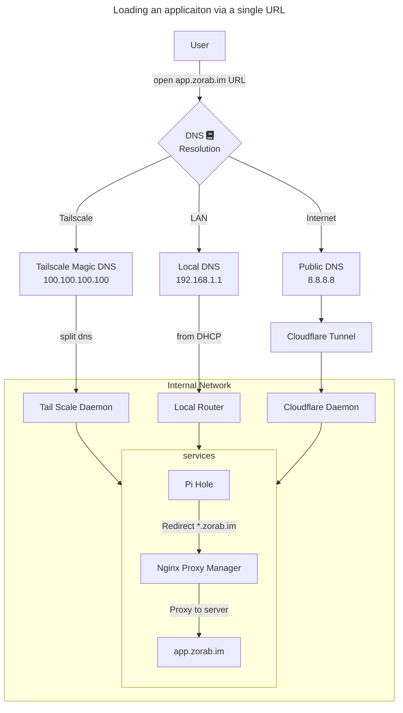

```mermaid 

---
title: Loading an applicaiton via a single URL
---

flowchart

    A["User"] -- open app.zorab.im URL --> C{"DNS fa:fa-book
    Resolution"}

    C -- Tailscale ---> ts["Tailscale Magic DNS 
        100.100.100.100"]
    F["Public DNS
        8.8.8.8"]
    C -- Internet --> F
    C -- LAN --> idns["Local DNS
        192.168.1.1"]
    F --> cf["Cloudflare Tunnel"]

    idns --  from DHCP ---> lclr    
    cf --> cfzt
    ts -- split dns ---> tsd
  
subgraph Internal["Internal Network"]
    direction TB
  
    tsd["Tail Scale Daemon"]
    lclr["Local Router"]
    cfzt["Cloudflare Daemon"]
    
    tsd --> services
    lclr --> services
    cfzt --> services

    subgraph services
        direction TB
        pi["Pi Hole"]
        npm["Nginx Proxy Manager"]
        I["app.zorab.im"]
       
        pi  -- Redirect *.zorab.im --> npm
        npm -- Proxy to server --> I
    end
    
end


```
